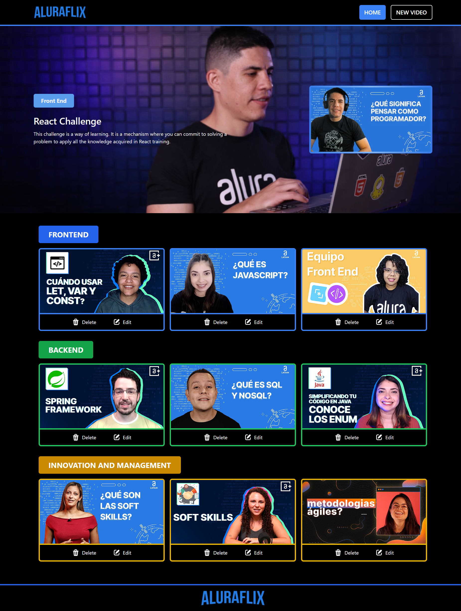
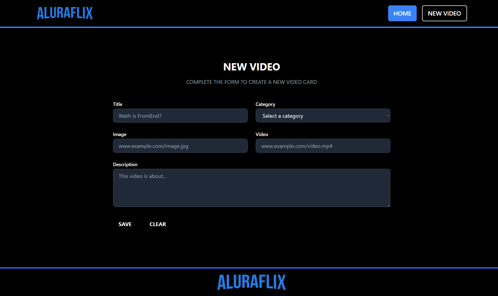

# AluraFlips

AluraFlips es una aplicación construida en **React** con **JavaScript**, diseñada para registrar, eliminar, actualizar y listar videos de diferentes categorías. Este proyecto forma parte de un desafío de desarrollo frontend, donde se exploran conceptos como la responsividad, manejo de estado global, y persistencia de datos en el navegador.

## Tabla de Contenidos

- [Características](#características)
- [Instalación](#instalación)
- [Uso](#uso)
- [Tecnologías Utilizadas](#tecnologías-utilizadas)
- [Estructura del Proyecto](#estructura-del-proyecto)
- [Contribución](#contribución)
- [Autor](#autor)

---

## Características

- **Registro de Videos**: Permite añadir videos con campos como:
  - Título
  - Categoría
  - Enlace de la imagen
  - Enlace del video
  - Descripción breve
- **Edición de Videos**: Cada video se puede editar mediante un formulario emergente.
- **Eliminación de Videos**: Opción para eliminar cualquier video registrado.
- **Responsividad**: Diseño adaptativo para dispositivos móviles, tabletas y desktops.
- **Estado Global**: Implementación de un estado global mediante un custom hook.
- **Persistencia de Datos**: Los videos registrados se almacenan en **Local Storage**.
- **Categorías Personalizadas**: Admite agregar categorías personalizadas para los videos.
- **Datos por Defecto**: Al iniciar la aplicación, se cargan videos predefinidos en el Local Storage.

---

## Instalación

Sigue estos pasos para instalar y ejecutar la aplicación en tu máquina local:

1. Clona este repositorio:
   ```bash
   git clone https://github.com/tu_usuario/alura-flips.git
   ```
2. Navega al directorio del proyecto:
   ```bash
   cd alura-flips
   ```
3. Instala las dependencias:
   ```bash
   npm install
   ```
4. Inicia la aplicación:
   ```bash
   npm start
   ```
5. Abre la aplicación en tu navegador en [http://localhost:5173](http://localhost:5173).

---

## Uso

### Página Principal (Home)

- Presenta un banner con una imagen de fondo y un card de ejemplo.
- Los videos se agrupan por categorías como "Frontend", "Backend" o "Innovación y Gestión".
- Cada card incluye un ícono para editar y eliminar el video.

### Registrar Video

- Haz clic en el botón **Registrar nuevo video** para abrir el formulario.
- Completa los campos requeridos y presiona **Guardar** para agregar el video.

### Editar Video

- Haz clic en el ícono de edición en el card del video.
- Aparecerá un formulario emergente para modificar los detalles del video.

### Responsividad

- Diseñado para adaptarse a dispositivos móviles, tabletas y desktops.
- Comprobado en diferentes tamaños de pantalla.

---

## Tecnologías Utilizadas

- **React**: Biblioteca para construir interfaces de usuario.
- **Tailwind CSS**: Framework de utilidades para estilos.
- **Local Storage**: Para persistir datos en el navegador.
- **Heroicons**: Íconos utilizados en los botones.

---

## Estructura del Proyecto

```
alura-flips/
├── public/
│   ├── index.html
├── src/
│   ├── components/
│   │   ├── Banner.jsx
│   │   ├── Button.jsx
│   │   ├── Courses.jsx
│   │   ├── EditModal.jsx
│   │   ├── Footer.jsx
│   │   ├── Form.jsx
│   │   └── Header.jsx
│   │   └── ImageCourse.jsx
│   ├── db/
│   │   └── db.js
│   ├── hooks/
│   │   └── useCourse.js
│   ├── pages/
│   │   ├── Home.js
│   │   └── NewVideo.js
│   └── App.jsx
├── package.json
```

---

## Contribución

¡Las contribuciones son bienvenidas! Por favor, sigue estos pasos:

1. Haz un fork del repositorio.
2. Crea una rama con tu nueva funcionalidad: `git checkout -b nueva-funcionalidad`.
3. Realiza los cambios y haz un commit: `git commit -m 'Agrega nueva funcionalidad'`.
4. Haz un push a tu rama: `git push origin nueva-funcionalidad`.
5. Abre un pull request.

---

## Autor

Desarrollado por [Juan Sebastián Sandoval Vargas](https://github.com/SebSandoval).

---

> **Nota**: Si necesitas incluir imágenes del diseño o capturas de pantalla de la aplicación, agrégalas en la carpeta `public/images` y actualiza este README con el siguiente formato:
>
> ```markdown
> ### Capturas de Pantalla
>
> #### Página Principal
>
> 
>
> #### Formulario de Registro
>
> 
> ```
